<picture>
  <source media="(prefers-color-scheme: light)" srcset="assets/banner/hero-v2-light.svg">
  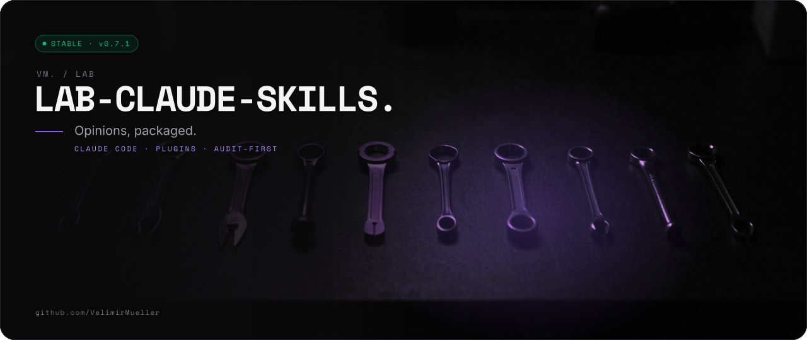
</picture>

<p align="center">

[](#-05-status) [](https://github.com/VelimirMueller) [](CHANGELOG.md) [](https://www.claude.com)

</p>

> Opinions, packaged.

```text
██       ████   █████
██      ██  ██  ██  ██
██      ██████  █████   █████
██      ██  ██  ██  ██
██████  ██  ██  █████
 █████  ██       ████   ██  ██  █████   ██████
██      ██      ██  ██  ██  ██  ██  ██  ██
██      ██      ██████  ██  ██  ██  ██  █████   █████
██      ██      ██  ██  ██  ██  ██  ██  ██
 █████  ██████  ██  ██   ████   █████   ██████
 █████  ██  ██  ██████  ██      ██       █████
██      ██ ██     ██    ██      ██      ██
 ████   ████      ██    ██      ██       ████
    ██  ██ ██     ██    ██      ██          ██
█████   ██  ██  ██████  ██████  ██████  █████   ██
```

Senior engineering judgment as audit-first Claude Code skills. One plugin per domain: 73 skills across 7 plugins, shipped as the Claude Code marketplace `frontendskills`. It does not write your app. It tells you where the seams go.

<picture>
  <source media="(prefers-color-scheme: dark)" srcset="assets/readme/stats-v2-dark.svg">
  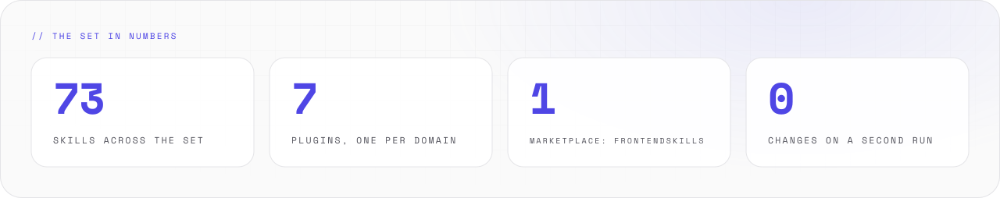
</picture>

<br>

## // 01 WHAT IT DOES

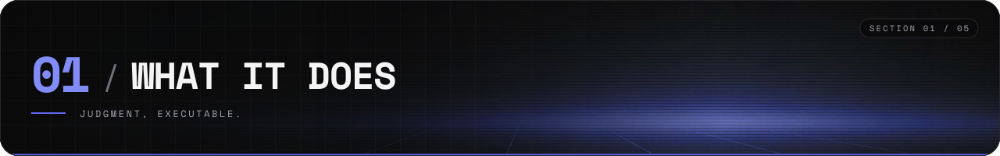

<picture>
  <source media="(prefers-color-scheme: dark)" srcset="assets/readme/features-v2-dark.svg">
  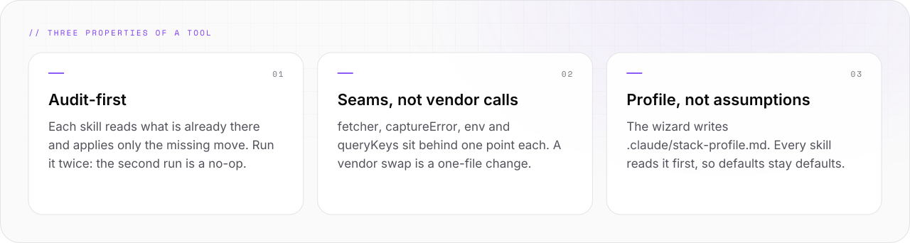
</picture>

- Ships as the Claude Code marketplace `frontendskills`: 73 skills in 7 plugins, licensed MIT.
- Covers React 19 / Vue 3 · Hono / Go / FastAPI · Supabase / Next 16 · Vercel / Hetzner / IONOS · Rust + Bevy.
- Reads your stack profile first, applies only the missing move, and changes nothing on a second run.
- Every rule ships with its *when to deviate*. The aim is judgment, not dogma.

<br>

## // 02 QUICK START

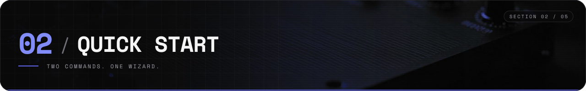

<picture>
  <source media="(prefers-color-scheme: dark)" srcset="assets/readme/start-v2-dark.svg">
  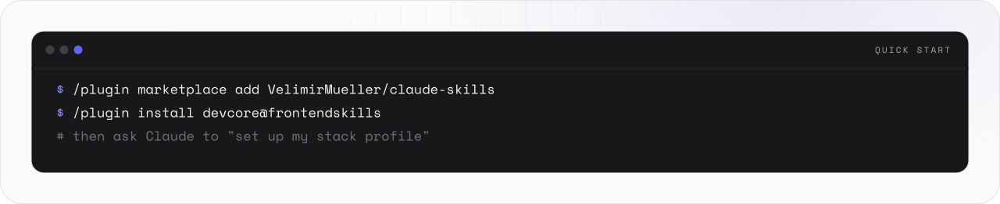
</picture>

Add the marketplace, install `devcore`, then run the wizard:

```text
/plugin marketplace add VelimirMueller/lab-claude-skills
/plugin install devcore@frontendskills
```

Then ask Claude to "set up my stack profile". The wizard detects the stack, asks only the gaps, writes `.claude/stack-profile.md`, and prints the plugins to enable.

- Every plugin depends on `devcore`, so installing any of them installs it too.
- Each enabled skill keeps its one-line `Use when` description in context, and loads in full only when that line matches.
- Install only the plugins your stack uses; the rest cost nothing.
- One step per plugin (Claude Code 2.1.275 or later adds the marketplace on the way): [REFERENCE.md](REFERENCE.md).
- Update with `/plugin marketplace update frontendskills`.

<br>

## // 03 HOW IT WORKS

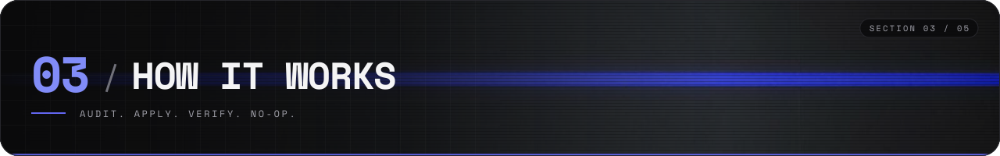

<picture>
  <source media="(prefers-color-scheme: dark)" srcset="assets/readme/flow-v2-dark.svg">
  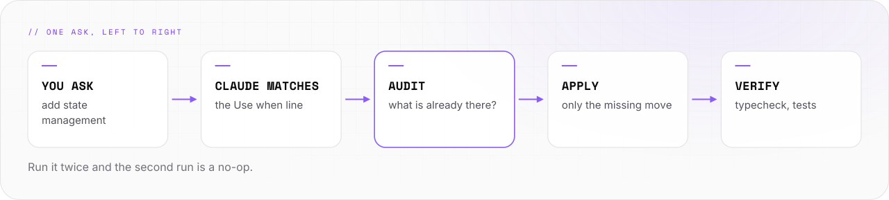
</picture>

```text
  you  ·  "add state management"
     │  Claude matches the "Use when" line
     ▼
  ┌──────────────────┐   reads   ┌──────────────────────┐
  │  SKILL.md        │ ────────▸ │  stack-profile.md    │
  │  one of 73       │           │  written once        │
  └────────┬─────────┘           └──────────────────────┘
           │  1 audit · 2 apply · 3 verify
           ▼
  ┌──────────────────┐
  │  your repo       │   second run = no-op
  └──────────────────┘

  devcore ◂── every other plugin depends on it
```

- **Audit-first.** Each skill inspects what is already there and applies only the missing move. A second run is a no-op.
- **Seams carry across the chain.** The router shares the `queryClient` with loaders, guards, forms and realtime. One OpenTelemetry pipeline ships every service's telemetry to one collector.
- **Profile, not assumptions.** Every skill reads `.claude/stack-profile.md` first, so the author's defaults — pnpm, Biome, tests in `tests/` — stay defaults.
- The full diagram and the composition chains are in [REFERENCE.md](REFERENCE.md).

<br>

## // 04 USAGE

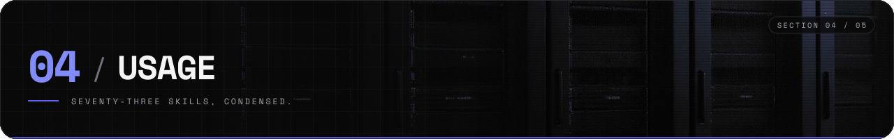

### The plugins

- `devcore` (`devcore@frontendskills`) — the stack-profile wizard, security and toolchain audits, commit and PR writing. 6 skills.
- `frontendskills` (`frontendskills@frontendskills`) — Vite-SPA lifecycle (React 19 / Vue 3) plus landing & content pages. 26 + 5 skills.
- `backendskills` (`backendskills@frontendskills`) — Hono / Go / FastAPI services, Supabase, Next 16. 15 skills.
- `infraskills` (`infraskills@frontendskills`) — containers, OpenTofu, deploys, secrets, OTel collector. 8 skills.
- `cliskills` (`cliskills@frontendskills`) — command-line tools and the dev toolchain. 3 skills.
- `aiskills` (`aiskills@frontendskills`) — LLM seams, RAG, evals, MCP servers. 5 skills.
- `gameskills` (`gameskills@frontendskills`) — Rust + Bevy games. 5 skills.

Every skill, with its one-line description, is in [REFERENCE.md](REFERENCE.md).

### Team setup

Commit the same setup to the project's `.claude/settings.json`, so everyone who trusts the folder gets the skills. Run the wizard once per repo and commit the resulting `.claude/stack-profile.md`. The exact JSON is in [REFERENCE.md](REFERENCE.md).

### Validate

```bash
bash scripts/validate.sh
```

Checks every marketplace entry, the shared version, catalogue ownership, every `SKILL.md`, and every relative `.md` link under `skills/`. CI runs the same script on every pull request.

### Further reading

- [RATIONALE.md](RATIONALE.md) — the design narrative: every load-bearing decision as *X over Y, for Z*.
- [CONTRIBUTING.md](CONTRIBUTING.md) — the house style, and how to add a skill that fits.
- [CHANGELOG.md](CHANGELOG.md) — what landed, and when.
- [REFERENCE.md](REFERENCE.md) — the full catalogue, install commands and run example.
- [skills/core/_shared/stack-profile.md](skills/core/_shared/stack-profile.md) — the schema every skill reads first, and its precedence.
- [skills/core/_shared/tech-radar.md](skills/core/_shared/tech-radar.md) — the Adopt/Hold lines the defaults come from.
- [skills/core/_shared/security-baseline.md](skills/core/_shared/security-baseline.md) — the shared security bar behind `audit-security` and `harden-backend`.
- [skills/core/_shared/audience.md](skills/core/_shared/audience.md) — the audience contract: one text the junior can follow, the senior can verify, the CTO can skim.
- [skills/frontend/_shared/architecture.md](skills/frontend/_shared/architecture.md) — the seam map: how one `queryClient` threads the whole app.
- [skills/frontend/_shared/fetcher.md](skills/frontend/_shared/fetcher.md) — the one canonical `fetcher`, base and auth versions.
- [skills/backend/_shared/service-layout.md](skills/backend/_shared/service-layout.md) — one layering standard for TypeScript, Go, and Python.
- [skills/landing/_shared/page-types.md](skills/landing/_shared/page-types.md) — the public-page gate and the priority inversion.

<br>

## // 05 STATUS

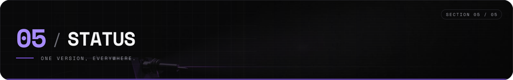

<picture>
  <source media="(prefers-color-scheme: dark)" srcset="assets/readme/status-v2-dark.svg">
  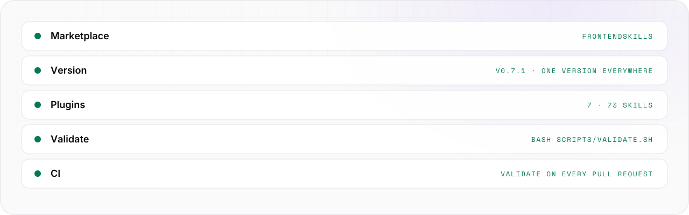
</picture>

**v0.7.1.** One marketplace, seven plugins, 73 skills. Every code block in the catalogues was built and run in scratch projects on 2026-10-09; anything not run is labelled unverified in place. Versions are floors in each catalogue's `_shared/stack-versions.md`.

```bash
bash scripts/validate.sh   # exit 0: every rule passes
```

Changes land in [CHANGELOG.md](CHANGELOG.md).

<br>

```text
-- EOF ---------------------------------------- OPINIONS, PACKAGED --
```

---

<sub>VM. studio / lab · open source · look per <code>vm-brand</code> playbook · [MIT](LICENSE) © 2026 Velimir Mueller</sub>
