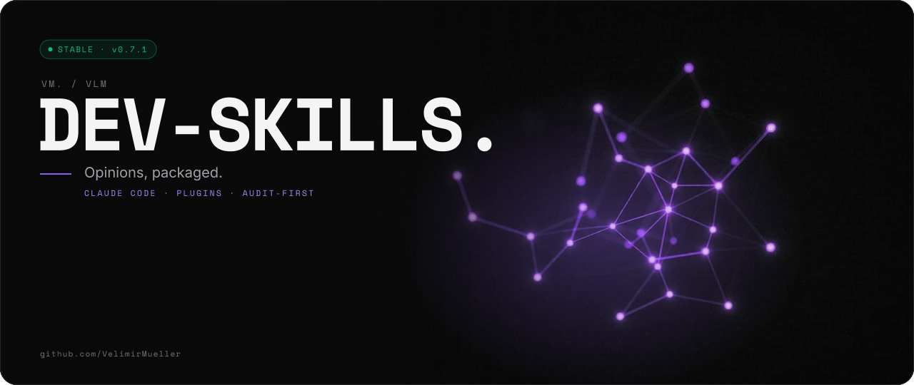

<picture>
  <source media="(prefers-color-scheme: light)" srcset="assets/banner/hero-v1-light.svg">
  
</picture>

   

> Opinions, packaged.

```text
█████   ██████  ██  ██
██  ██  ██      ██  ██
██  ██  █████   ██  ██  █████
██  ██  ██       ████
█████   ██████    ██
 █████  ██  ██  ██████  ██      ██       █████
██      ██ ██     ██    ██      ██      ██
 ████   ████      ██    ██      ██       ████
    ██  ██ ██     ██    ██      ██          ██
█████   ██  ██  ██████  ██████  ██████  █████   ██
```

## // 01 WHAT IT DOES

- Packages senior engineering judgment as **audit-first Claude Code skills**: frontend to infra, one plugin per domain.
- Ships as the Claude Code marketplace `frontendskills`: `73 skills` in `7 plugins`, licensed `MIT`.
- Covers `React 19 / Vue 3 · Hono / Go / FastAPI · Supabase / Next 16 · Vercel / Hetzner / IONOS · Rust + Bevy`.
- Reads your stack profile first, applies only the missing move, and changes nothing on a second run.

### The idea

Every senior carries a body of judgment that rarely gets written down — where server state ends
and UI state begins, why a token must never touch `localStorage`, what a "molecule" is. It lives
in one head and leaves when they do.

`claude_development_skills` takes that judgment out of the head and makes it executable — on
demand, on any codebase, the same way every time. Four properties make it a *tool* rather than
a template:

- **Audit-first & idempotent.** Each skill inspects what is already there and applies only the
  missing move. Point it at an empty directory and it scaffolds; point it at a three-year-old
  repo and it brings one concern up to standard; run it twice and the second run is a no-op.
- **Seams, not scattered vendor calls.** `fetcher`, `captureError`, `env`, `queryKeys`, the
  analytics and flag clients, the OpenTelemetry pipeline — one point of indirection each, so
  swapping a vendor or mocking a test is a one-file change.
- **Boundaries that make bugs unrepresentable.** Server data lives in the Query cache, never a
  store; tokens never touch `localStorage`; a secret key never reaches a bundle. The worst
  recurring bugs are designed out, not patched.
- **Profile, not assumptions.** A one-time `set-up-stack-profile` wizard detects the stack, asks
  only the gaps, and writes `.claude/stack-profile.md`; every skill reads it first, so the
  author's defaults — pnpm, Biome, tests in `tests/` — are defaults, not mandates.

Every rule ships with its *when to deviate*. The aim is judgment, not dogma.

## // 02 QUICK START

Add the marketplace and install `devcore`, then run the wizard:

```
/plugin marketplace add VelimirMueller/claude_development_skills
/plugin install devcore@frontendskills
```

Then ask Claude to "set up my stack profile". The wizard detects the stack, asks only the gaps,
writes `.claude/stack-profile.md`, and prints the plugins to enable and the skill order.

| Plugin | Install id | For | Skills |
|---|---|---|---|
| devcore | `devcore@frontendskills` | the stack-profile wizard, security and toolchain audits, commit and PR writing | 6 |
| frontendskills | `frontendskills@frontendskills` | Vite-SPA lifecycle (React 19 / Vue 3) + landing & content pages | 26 + 5 |
| backendskills | `backendskills@frontendskills` | Hono / Go / FastAPI services, Supabase, Next 16 | 15 |
| infraskills | `infraskills@frontendskills` | containers, OpenTofu, deploys, secrets, OTel collector | 8 |
| cliskills | `cliskills@frontendskills` | command-line tools and the dev toolchain | 3 |
| aiskills | `aiskills@frontendskills` | LLM seams, RAG, evals, MCP servers | 5 |
| gameskills | `gameskills@frontendskills` | Rust + Bevy games | 5 |

Every plugin depends on `devcore`, so installing any of them installs it too. Each enabled
skill keeps its one-line `Use when` description in context on every turn, and loads in full only
when that line matches. Install only the plugins your stack uses; the rest cost nothing.

One step per plugin (Claude Code 2.1.275 or later adds the marketplace on the way):

```
/plugin install devcore --marketplace VelimirMueller/claude_development_skills
/plugin install frontendskills --marketplace VelimirMueller/claude_development_skills
/plugin install backendskills --marketplace VelimirMueller/claude_development_skills
/plugin install infraskills --marketplace VelimirMueller/claude_development_skills
/plugin install cliskills --marketplace VelimirMueller/claude_development_skills
/plugin install aiskills --marketplace VelimirMueller/claude_development_skills
/plugin install gameskills --marketplace VelimirMueller/claude_development_skills
```

## // 03 HOW IT WORKS

```text
  you  ·  "add state management"  ·  "set up my stack profile"
     │  Claude matches the skill's one-line "Use when" description
     ▼
  ┌────────────────────────┐   reads first   ┌─────────────────────────────┐
  │  skill  (SKILL.md)     │ ──────────────▸ │  .claude/stack-profile.md   │
  │  one of 73, 7 plugins  │                 │  written once by the wizard │
  └───────────┬────────────┘                 └─────────────────────────────┘
              │  1 audit   what is already there?
              │  2 apply   only the missing move, behind one seam
              │  3 verify  typecheck · tests
              ▼
  ┌────────────────────────┐
  │  your repo             │   second run = no-op
  └────────────────────────┘

  devcore ◂── every other plugin depends on it (shared contracts)
```

### How it composes

The skills interlock front-to-back. A greenfield frontend runs roughly:

```
scaffold → clean → configure-typescript → validate-env → configure-linting →
set-up-frontend-structure → set-up-state-management → set-up-error-boundaries →
configure-test-stack → set-up-routing → set-up-forms → set-up-auth → … → experience & polish
```

The router carries the `queryClient` in its context, so a route loader prefetches into the exact
cache a component's hook reads; the auth guard reads that same context; the form's submit
invalidates that same query key; realtime writes into it from a socket. Because every skill is
audit-first, this is a guide, not a constraint: run any one against an existing project.

A backend service and its deployment compose the same way:

```
set-up-stack-profile → scaffold-<track>-service → set-up-database → design-http-api →
set-up-backend-auth → harden-backend → set-up-observability → configure-backend-tests →
containerize-service → set-up-delivery-pipeline → deploy-to-<host> → deploy-otel-collector
```

The seams carry across the whole chain. Each service keeps its I/O vendors — db, logger, tracer,
clock — behind one `platform/` seam; the frontend reaches it through its `fetcher` seam with the
OpenAPI client `design-http-api` generated; one OpenTelemetry pipeline ships every service's
telemetry to one collector; one `deploy.sh` contract is all `deploy-to-<host>` expects.

## // 04 USAGE

### The catalogue

#### devcore

- **`set-up-stack-profile`** — Detects the stack, asks only the gaps, writes `.claude/stack-profile.md`.
- **`audit-security`** — Scans secrets, deps, authz, headers, CI; fixes only approved findings.
- **`audit-toolchain`** — Compares tooling to the radar and profile; reports gaps, changes nothing.
- **`extend-skillset`** — Authors a house-style skill for a tool nothing covers.
- **`write-commit-messages`** — A subject and body any developer can act on.
- **`write-pull-requests`** — A description reviewers can follow end to end.

#### frontendskills

**Bootstrap & tooling**

- **`scaffold-frontend-project`** — Vite + TS SPA (React 19 / Vue 3), pnpm, Node LTS, Tailwind v4.
- **`clean-frontend-scaffolding`** — Strips the Vite demo down to a minimal shell.
- **`configure-typescript`** — Strict flags, TS 6/7-safe paths, one `@/` alias in sync.
- **`validate-env`** — Zod-validates `import.meta.env` once; exports a typed `env`.
- **`configure-linting`** — Biome as the only lint/format/sort tool, plus a pre-commit hook.
- **`set-up-frontend-structure`** — Atomic-design folders, feature modules, tests in `tests/`.
- **`create-module`** — Routes new logic to the right layer, keeping components thin.

**State, data & resilience**

- **`set-up-state-management`** — TanStack Query for server state, Zustand/Pinia for UI state.
- **`set-up-realtime`** — A WebSocket seam writing server push into the Query cache.
- **`set-up-error-boundaries`** — Layered boundaries behind a pluggable `captureError` seam.
- **`configure-error-tracking`** — Points `captureError` at Sentry; no-op without a DSN.

**Testing**

- **`configure-test-stack`** — Vitest, Storybook stories-as-tests, Playwright, MSW under `tests/`.

**Capabilities**

- **`set-up-routing`** — TanStack Router / Vue Router: typed, lazy, loader→Query prefetch, guards.
- **`set-up-forms`** — React Hook Form / VeeValidate + Zod: schema-first, submit → mutation.
- **`set-up-auth`** — Current user as server state, no `localStorage`, single-flight 401 refresh.
- **`set-up-i18n`** — i18next / vue-i18n: typed keys, lazy locales, `Intl` formats.
- **`set-up-document-head`** — Per-route title/meta/OG plus a truthful `<html lang>`.
- **`set-up-feature-flags`** — Vendor-agnostic OpenFeature seam with fail-closed defaults.

**Experience**

- **`set-up-design-system`** — Tailwind v4 `@theme` tokens, dark mode, cva primitives.
- **`configure-accessibility`** — a11y lint, semantic/focus/reduced-motion rules, axe in tests.
- **`optimize-performance`** — React Compiler, route splitting, bundle budget, Core Web Vitals.

**Polish**

- **`set-up-motion`** — Native View Transitions + Motion, reduced-motion-gated.
- **`set-up-pwa`** — `vite-plugin-pwa` offline shell, installable, optional cache persistence.
- **`configure-analytics`** — Provider-agnostic, consent-gated analytics seam + Web Vitals.

**Shipping & security**

- **`configure-ci`** — A least-privilege GitHub Actions gate and preview deploys per PR.
- **`set-up-security-headers`** — A strict CSP and headers, dependency hygiene, honest XSS surface.

**Landing & content pages (framework-agnostic)**

- **`build-landing-page`** — One job per page: section grammar, semantic skeleton, LCP/CLS budget.
- **`set-up-seo`** — The crawlability gate, metadata, JSON-LD, sitemap, robots.
- **`set-up-lead-capture`** — The destination seam, layered spam defense, consent, double opt-in.
- **`audit-content-quality`** — Scores pages against a rubric; fixes only failed criteria.
- **`audit-copy-compliance`** — Pre-publish copy gate: each violation quoted with a compliant rewrite.

These five audit *built HTML* from any stack and gate on the page-level question in
[`skills/landing/_shared/page-types.md`](skills/landing/_shared/page-types.md): readable without JS?

#### backendskills

**Service scaffolds**

- **`scaffold-hono-service`** — A strict-TS Hono service with OpenAPI and health checks.
- **`scaffold-go-service`** — A stdlib `net/http` Go service: layers, slog, validated config.
- **`scaffold-fastapi-service`** — A uv src-layout FastAPI service with lifespan and problem+json.

**Contracts & data**

- **`design-http-api`** — OpenAPI 3.1 contract, RFC 9457 errors, generated typed client.
- **`set-up-database`** — Postgres via compose, ORM/sqlc, migrations, a safety gate.
- **`set-up-background-jobs`** — A Postgres-backed queue, outbox, idempotent handlers, retries.

**Security & operations**

- **`set-up-backend-auth`** — Verifies OIDC JWTs, BFF cookies, deny-by-default policies, tenant scoping.
- **`harden-backend`** — Validation, rate/size limits, CORS, SSRF-safe fetch, CI scanning.
- **`set-up-observability`** — OpenTelemetry: SDK first, HTTP/DB instrumentation, RED metrics.
- **`configure-backend-tests`** — Unit, real-Postgres integration, HTTP, and contract tests.

**Supabase & Next.js**

- **`build-nextjs-backend`** — A server-only data layer authorizing every call in Next 16.
- **`build-supabase-edge-function`** — Edge Functions with caller auth, CORS, secrets, tests.
- **`secure-supabase-rls`** — RLS on every table, per-operation policies, proven with pgTAP.
- **`set-up-nextjs-supabase-auth`** — Supabase Auth in Next 16: cookie clients, verified claims, PKCE.
- **`set-up-supabase`** — CLI local stack, migrations-only schema, generated types, secret-safe client.

#### infraskills

- **`containerize-service`** — Multi-stage Dockerfile per track: non-root, pinned, scanned.
- **`deploy-otel-collector`** — One Compose collector per environment exporting to any OTLP backend.
- **`deploy-to-hetzner`** — OpenTofu VM per environment, firewall, Traefik TLS, image-digest deploys.
- **`deploy-to-ionos`** — IONOS Cloud via OpenTofu, or Deploy Now for a static site.
- **`deploy-to-vercel`** — Linking, env per environment, protected previews, rollback, gated deploys.
- **`manage-secrets`** — Decide where each secret lives; keep them out of images, logs, bundles.
- **`set-up-delivery-pipeline`** — Trunk-based CI/CD: one image, promote dev→stg→prd by digest.
- **`set-up-opentofu`** — OpenTofu layout, encrypted state, plan-as-artifact, drift detection.

#### cliskills

- **`build-cli`** — Subcommands, typed args, `--json`, exit codes, `--dry-run`, tested.
- **`release-cli`** — SemVer over the CLI surface, changelog-driven notes, signed artifacts.
- **`set-up-dev-toolchain`** — mise or just, shared tasks, lefthook hooks, a doctor task.

#### aiskills

- **`build-llm-seam`** — One module owns every model call: tiers, retries, structured output.
- **`build-mcp-server`** — Task-shaped tools, read-only by default, typed inputs, tested.
- **`build-rag-pipeline`** — Hybrid retrieval over pgvector, citations, an "I don't know" path.
- **`secure-llm-features`** — Prompt-injection model, least-privilege tools, mapped to OWASP LLM Top 10.
- **`set-up-llm-evals`** — Golden datasets, deterministic checks, a calibrated judge, CI gate.

#### gameskills

- **`scaffold-bevy-game`** — A lib+bin cargo project with fast builds and optional wasm.
- **`structure-bevy-app`** — Plugin-per-feature layout, app states, system ordering.
- **`manage-bevy-assets`** — One asset-table seam, custom loaders, hot reload, embedded assets.
- **`test-bevy-systems`** — Headless App/World tests with MinimalPlugins and deterministic time.
- **`optimize-bevy-game`** — Measure first, then fix change detection, parallelism, allocations.

### Team setup

For a team, commit the same setup to the project's `.claude/settings.json`, so everyone who
trusts the folder gets the skills:

```json
{
  "extraKnownMarketplaces": {
    "frontendskills": {
      "source": { "source": "github", "repo": "VelimirMueller/claude_development_skills" }
    }
  },
  "enabledPlugins": {
    "devcore@frontendskills": true,
    "backendskills@frontendskills": true
  }
}
```

Run the wizard once per repo and commit the resulting `.claude/stack-profile.md` — it is team
knowledge, not a secret, and it is what makes the author's defaults stay defaults.

Update with `/plugin marketplace update frontendskills`.

### What a run looks like

Illustrative: `set-up-state-management` on a fresh `pnpm create vite` React app. You ask *"add
state management"*; Claude matches the `Use when` line and works through it:

```text
1. Audit     no @tanstack/react-query, no zustand, no src/libs/fetcher.ts   → full setup
2. Framework react 19 detected                                                → React track
3. Install   pnpm add @tanstack/react-query zustand
             pnpm add -D @tanstack/react-query-devtools
4. Seams     src/libs/fetcher.ts  src/libs/queryKeys.ts  src/libs/queryClient.ts
5. Examples  src/hooks/useTodos.ts  src/hooks/useCreateTodo.ts  src/stores/useTodoFiltersStore.ts
6. Wire      src/main.tsx → <QueryClientProvider> + devtools in DEV only
7. Verify    pnpm typecheck
```

Run it a second time and step 1 finds everything in place: the skill exits with *"State
management already in place."* and changes nothing.

### Validate

```bash
bash scripts/validate.sh
```

Checks that every marketplace entry carries a name, version, description, and `skills` list;
that one version is shared by every entry, `metadata.version`, the CHANGELOG top entry, and the
README Status line; that each catalogue is owned by exactly one plugin; that every `SKILL.md` has
a `name` matching its folder and a description starting with "Use when", at most 300 characters,
and valid YAML; that skill names are unique across catalogues; and that every relative `.md` link
under `skills/` resolves. CI runs the same script on every pull request.

### Further reading

- **[RATIONALE.md](RATIONALE.md)** — the design narrative: every load-bearing decision as *X over Y, for Z*.
- **[CONTRIBUTING.md](CONTRIBUTING.md)** — the house style, and how to add a skill that fits.
- **[CHANGELOG.md](CHANGELOG.md)** — what landed, and when.
- **[skills/core/_shared/stack-profile.md](skills/core/_shared/stack-profile.md)** — the schema every skill reads first, and its precedence.
- **[skills/core/_shared/tech-radar.md](skills/core/_shared/tech-radar.md)** — the Adopt/Hold lines the defaults come from.
- **[skills/core/_shared/security-baseline.md](skills/core/_shared/security-baseline.md)** — the shared security bar behind `audit-security` and `harden-backend`.
- **[skills/core/_shared/audience.md](skills/core/_shared/audience.md)** — the audience contract: one text the junior can follow, the senior can verify, the CTO can skim.
- **[skills/frontend/_shared/architecture.md](skills/frontend/_shared/architecture.md)** — the seam map: how one `queryClient` threads the whole app.
- **[skills/frontend/_shared/fetcher.md](skills/frontend/_shared/fetcher.md)** — the one canonical `fetcher`, base and auth versions.
- **[skills/backend/_shared/service-layout.md](skills/backend/_shared/service-layout.md)** — one layering standard for TypeScript, Go, and Python.
- **[skills/landing/_shared/page-types.md](skills/landing/_shared/page-types.md)** — the public-page gate and the priority inversion.

## // 05 STATUS

| | |
|---|---|
| 🟢 **Stable** | 0.7.1 · one version for every plugin, the marketplace and the CHANGELOG |
| Tests | `bash scripts/validate.sh` (CI runs it on every pull request) |
| Changes | [`CHANGELOG.md`](CHANGELOG.md) |

### Status

**v0.7.1.** One marketplace, seven plugins, 73 skills. Every code block in the new catalogues
was built and run in scratch projects on 2026-10-09, and anything not run is labelled unverified
in place. Versions are floors in each catalogue's `_shared/stack-versions.md`.

### License

MIT © 2026 Velimir Müller.

---

<sub>VM. studio / vlm · open source · look per <code>vm-brand</code> playbook</sub>
